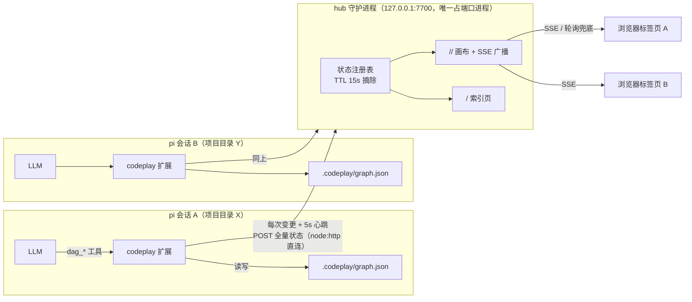

# Codeplay 设计架构文档（产品原型）

> 版本：v0.1.0 · 仓库：[github.com/vcvcvnvcvcvn/pi-codeplay](https://github.com/vcvcvnvcvcvn/pi-codeplay)

## 1. 产品定位

**一句话**：给编码 agent 一块"共享画板"——agent 在干活的同时维护一张有向无环图（DAG），用户在浏览器里实时看到它在做什么、做到哪了、各部分什么关系。

**要解决的问题**：CLI 里的编码 agent 对用户是黑盒——
- 用户不知道 agent 进行到哪一步，只能在滚动的文本里翻
- 任务一复杂，"改了哪些文件、为什么、还剩什么"全靠追问
- 多项目并行时，多个会话的进度没有任何统一视图

**核心价值主张**：把"对话"升级为"对话 + 结构"。DAG 是最通用的中间媒介——它既能表示任务进度，也能表示项目架构、依赖关系、数据流转。

**目标用户**：使用 pi 的开发者；尤其是同时跑多个项目、或跑长任务的人。

## 2. 目标与非目标

| 目标（v1） | 非目标 |
|---|---|
| agent 增量画图，用户实时观看 | 用户手动编辑图（v2 再做双向通道） |
| 阶段性消息播报（公告栏） | 项目管理功能（排期、负责人、燃尽图） |
| 节点关联文件，点击可查 | IDE 级文件跳转/预览 |
| 多项目单端口统一入口 | 云端同步、多人协作 |
| 低上下文成本（短 ID、紧凑文本） | 精确到函数级别的代码地图 |

## 3. 核心概念与数据模型

### 画布（Canvas）
- 每个 **pi 启动目录**对应一块画布，天然隔离
- 画布 URL：`http://127.0.0.1:7700/<文件夹名>/`（slug 化，冲突自动加后缀）

### 节点（Node）
| 字段 | 说明 |
|---|---|
| id | 短 ID：`n1`、`n2`…（节省 LLM 上下文） |
| name | 名称 |
| brief | 简介（一句话） |
| files | 囊括的文件路径列表 |
| status | `pending` 未开始 / `active` 进行中 / `done` 已完成 |

### 边（Edge）
| 字段 | 说明 |
|---|---|
| id | 短 ID：`e1`、`e2`… |
| source / target | 出/入节点 |
| note | 边备注（如"依赖""数据流"） |

约束：**强制无环**（成环/自环在工具层拒绝）——保证图永远是可分层布局的 DAG。

### 消息（Message）
阶段性进度消息 `{id: m1, text, ts}`，画布公告栏逐条展示，保留最近 50 条。

### 持久化
`<cwd>/.codeplay/graph.json`，每次变更落盘。会话才是数据源；hub 不存数据。

## 4. 用户旅程

### 主旅程：看着 agent 干活
```
启动 pi（项目目录）
   │  （hub 自动拉起，无弹窗打扰）
   ▼
给 agent 布置任务
   │  agent 增量画图：开始某部分 → 加节点/标 active；完成 → 标 done
   ▼
首次 dag_* 工具调用 → 浏览器自动弹出画布（每会话仅一次）
   │
   ▼
用户：看 DAG 全局结构 → 点节点看简介+文件 → 公告栏读进度播报
```

### 辅助旅程
- **多项目**：任意项目画布顶栏点「全部项目」→ 索引页列出所有进行中的项目，点击跳转
- **新项目/重来**：agent 调 `dag_clear`（需 confirm）清空画布
- **手动打开**：pi 里输入 `/dag`

### agent 侧行为准则（system prompt 注入）
1. 图随工作**增量生长**，不要一开始画全
2. 粒度自适应：简单任务画细（让用户看到持续推进），难任务画粗（先大阶段，需要再细分）
3. 状态实时同步：开始时标 active，完成标 done，文件挂到节点上
4. **事前播报**：开始加模块前、开始跑测试前必须发公告；完成一步、关键决策、遇到阻塞也要发
5. 图是沟通媒介不是交付物——不许为了图好看拖延编码

## 5. 界面原型

### 画布页 `/<项目名>/`
```
┌────────────────────────────────────────────────────────────┐
│ Codeplay DAG可视化面板 [项目名]  ○未开始 ●进行中 ●已完成    │
│              [实时连接] [公告②] [全部项目] [重新布局] [适应] │
├────────────────────────────────────────────────────────────┤
│                                            ┌─────────────┐ │
│   ·  ·  ·  · 点阵背景 ·  ·  ·             │ 节点详情/公告栏 │ │
│                                            │ (右侧抽屉)   │ │
│        ┌────────┐                          └─────────────┘ │
│        │ 需求分析 │ (绿=已完成)                              │
│        └───┬────┘                                          │
│            ▼ 产出架构                                       │
│        ┌────────┐                                          │
│        │ 架构设计 │ (黄=进行中)                              │
│        └───┬────┘                                          │
│            ▼                                               │
│        ┌────────┐                                          │
│        │ 编码实现 │ (灰=未开始)                              │
│        └────────┘                                          │
└────────────────────────────────────────────────────────────┘
```

**视觉规范**：浅色调、点阵画布背景、圆角节点、1px 轻描边；状态色 pastel 化（灰 `#e5e8ee` / 黄 `#fde68a` / 绿 `#bbf7d0`）；选中态蓝色描边。

**交互**：
- 点节点 → 右侧详情（名称/状态徽章/简介/文件清单）；点边 → 备注与两端节点；点空白关闭
- 结构变化 → dagre 自动重排（缩放钳制 ≤1，少节点不放大）；仅状态变化 → 原地变色，不重排
- 公告按钮带未读红角标（已读状态存 localStorage）；SSE 断线自动降级 3s 轮询

### 索引页 `/`
项目卡片流：显示名 + slug 徽章 + 目录 + 完整 URL + 启动时间，3 秒自动刷新。

## 6. 系统架构



### 数据流（一次变更）
```
LLM 调工具 → withFileMutationQueue 串行化 → 改内存图 → 落盘 graph.json
→ fire-and-forget POST 给 hub → hub 比对快照 → 变化才广播 SSE
→ 前端增量 diff（结构变→重排；状态变→换色）
```

### 关键设计决策

| 决策 | 选择 | 理由 |
|---|---|---|
| 端口模型 | **单 hub 独占 7700**，会话只作客户端 | 会话是独立进程；每会话一端口会让用户记端口，主从代理又会把生命周期耦合在一起。hub 空闲 5 分钟自退，不留垃圾进程 |
| 会话→hub 通信 | 裸 `node:http`，**不用 fetch** | pi/provider 会给 LLM 流量装全局代理 dispatcher，会把 127.0.0.1 的请求也卷进去挂死（真实踩过的坑） |
| 推送时机 | 变更即推 + 5s 心跳，**fire-and-forget** | 面板同步绝不能拖住 agent（曾因此每次工具调用卡数秒） |
| 残留清理 | 心跳 TTL 15s | 会话被 kill -9 也不会留下僵尸卡片/画布 |
| 浏览器打开 | 首次工具调用时才弹，每会话一次 | 启动即弹窗是打扰；不弹用户又不知道面板存在 |
| 图库存储 | 按目录存文件 | 浏览器需要稳定数据源；代价是不随会话分支回溯（v1 取舍） |
| 前端技术 | Cytoscape.js + dagre，vendor 本地化 | 无构建步骤、离线可用、DAG 分层布局成熟 |
| 静态资源路径 | `realpath(import.meta.url)` 先解析文件再取目录 | jiti 加载软链时保留链接路径（踩过的坑：目录不是软链，先取目录会丢真实路径） |

## 7. LLM 协同设计

**工具集（9 个）**：`dag_view`、`dag_add_node`、`dag_update_node`、`dag_remove_node`、`dag_add_edge`、`dag_update_edge`、`dag_remove_edge`、`dag_announce`、`dag_clear`

设计原则：
- **短 ID**（n1/e1/m1）：一切引用都便宜，上下文友好
- **单字段更新**：`dag_update_node(id, field, value)` 一次只改一个字段——schema 简单、各 provider 兼容、调用意图明确
- **值用字符串承载**：files 逗号分隔、status 接受中英文别名（进行中→active），降低模型出错率
- **破坏性操作要确认**：`dag_clear` 必须 `confirm: true`
- **prompt 注入走 `systemPromptOptions.sections`**：pi 做增量 diff，不会每轮重发全量 system prompt（缓存友好）

## 8. 生命周期与异常

| 场景 | 行为 |
|---|---|
| hub 没在跑 | 首个会话推送时自动拉起（detached） |
| 7700 被其他程序占 | 报错并退避 20s，agent 不受影响 |
| 会话 `/reload` | 不重复开浏览器标签；已有标签经 SSE 重连 |
| 会话被 kill -9 | 画布/卡片最多残留 15s（TTL 摘除） |
| 同名项目 | slug 自动加后缀 `game` → `game-2` |
| hub 被杀 | 下次推送自动重启；图数据无损失（在会话侧文件里） |

## 9. 已知限制与路线图

**v1 限制**：前端只读；图不随会话分支回溯；同一目录多会话共享画布（后写胜出）。

**路线图**：
- v2 双向通道：用户在画布上改状态/备注 → 回写给 agent（SSE 通道已就位，只差上行端点）
- 分支回溯：图状态迁入 tool result details（参考 pi todo 示例）
- npm 发布 + pi.dev 包广场（`pi-package` keyword 已就位）
- 消息公告支持级别（info/warn/blocker）与声音提醒
